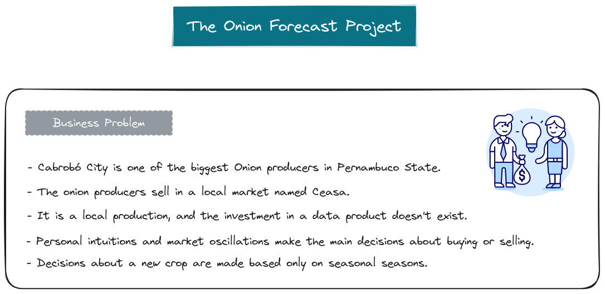
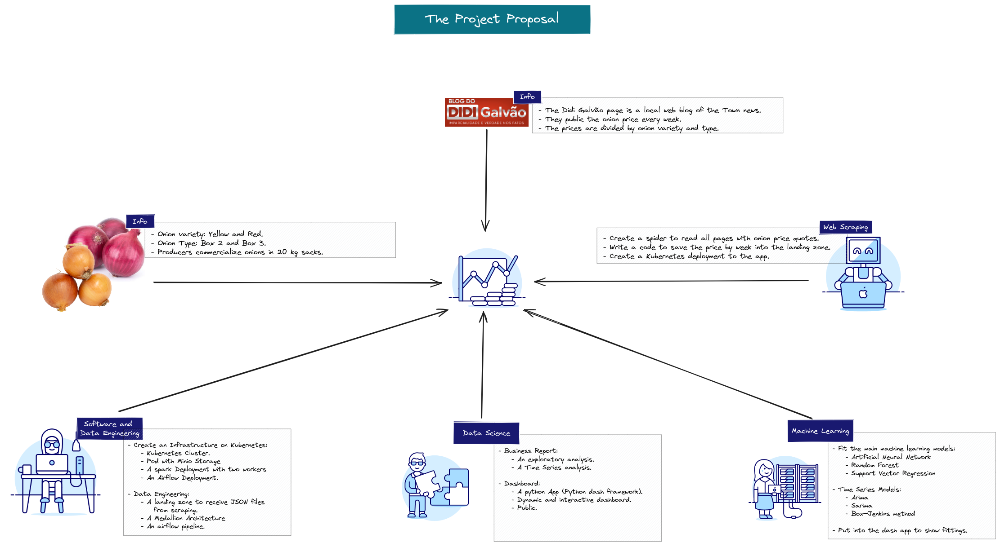
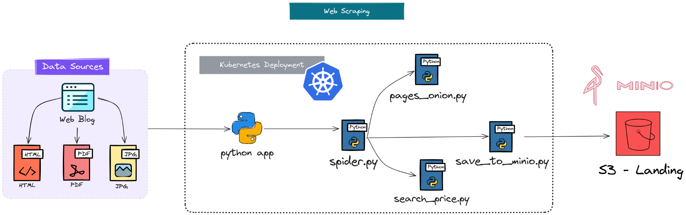

# Onion Forecast

The cultivation and sale of onions are strategic for the economy of the city of Cabrobó. Being one of the main crops and one of the most economically advantageous, it is also one of the least developed technologies, both for production and for a more in-depth analysis of planting conditions and economic yield.

The onion price forecast project provides an in-depth view of the historical behaviour of the Cabroboense onion market. It also provides an in-depth statistical analysis of onion sales. Finally, an application is presented for the public to have easy and direct access to the primary studies and metrics on variations in the onion market. A tool is also available to make onion price forecasts for each variety and type.

## Business Problem

## Hight Level Project

## Web Scraping

## Kubernetes Infrastructure

